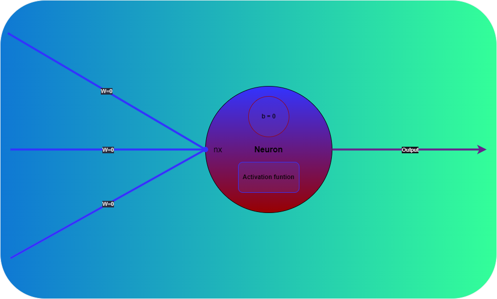

# Classification in Supervised Learning

## Overview

This project demonstrates the principles and applications of classification in supervised learning using various algorithms and techniques. Classification is a type of supervised learning where the goal is to predict a categorical label for given input data.

## Table of Contents

- [Overview](#overview)
- [Installation](#installation)
- [Dataset](#dataset)
- [Models](#models)
- [Usage](#usage)
- [Results](#results)
- [Contributing](#contributing)
- [License](#license)

## Installation

To run this project, make sure you have Python 3.11.3 installed. You will also need to install the following dependencies:

- pandas
- numpy
- scikit-learn
- matplotlib
- seaborn

You can install these packages using pip:

```bash
pip install pandas numpy scikit-learn matplotlib seaborn
```

## Dataset

The dataset used in this project is **[Insert Dataset Name]**. It contains the following features:

- **Feature 1**: Description of feature 1
- **Feature 2**: Description of feature 2
- **Feature 3**: Description of feature 3
- ...
- **Label**: Target variable we aim to predict

## Models

Several classification models are implemented and compared in this project, including:

- **Logistic Regression**
- **Decision Tree**
- **Random Forest**
- **Support Vector Machine (SVM)**
- **K-Nearest Neighbors (KNN)**
- **Naive Bayes**

## Usage

1. **Data Preprocessing**: Load the dataset and perform necessary preprocessing like handling missing values, encoding categorical variables, and feature scaling.

2. **Model Training and Evaluation**: Train each classification model using the training dataset and evaluate its performance using metrics like accuracy, precision, recall, F1-score, and ROC-AUC.

3. **Visualization**: Visualize the results with confusion matrices, ROC curves, and other relevant plots.

You can run the main script to execute the entire workflow:

```bash
python main.py
```

## Files
### 0. **0-neuron.py**



## Contributing

Contributions are welcome! Please fork this repository and create a pull request with your changes. Ensure that your contributions adhere to the coding standards and include proper documentation.

## License

This project is licensed under the MIT License. See the [LICENSE](LICENSE) file for details.